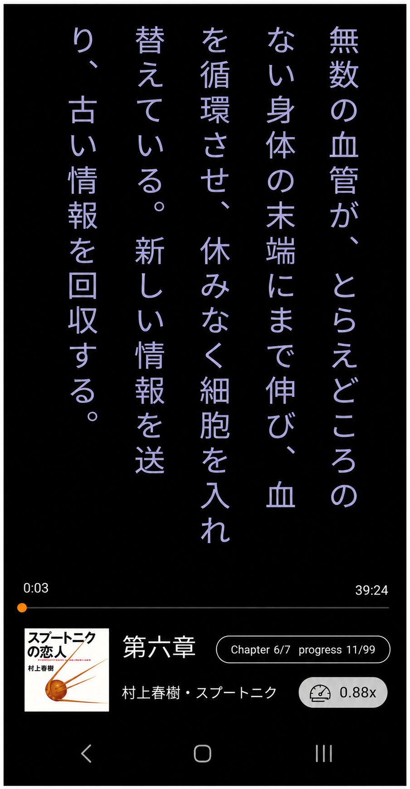
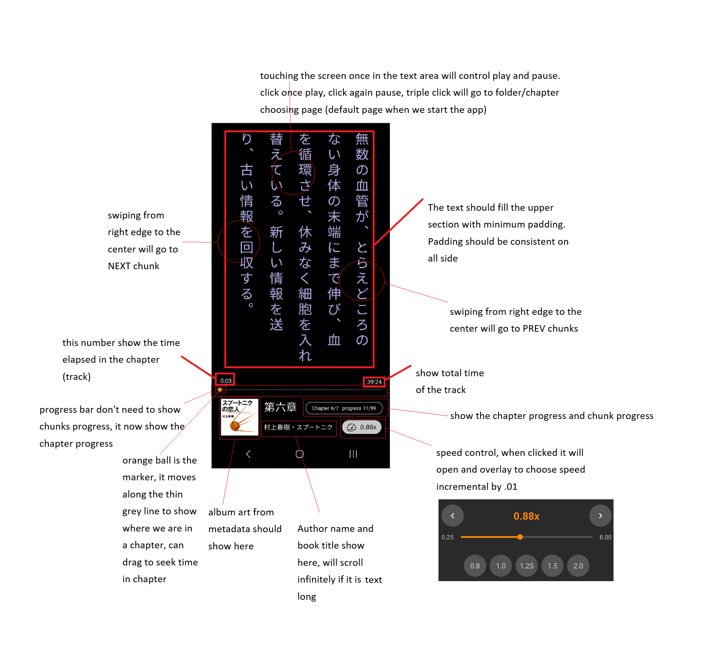

# SHAMA — a Japanese audiobook reader for Android

SHAMA plays audiobooks the way you'd actually want to read along with
them: vertical, page-by-page Japanese text that highlights itself
character by character in sync with the narration, gesture controls
instead of buttons, and a book-like reading rhythm instead of a generic
media player skin.

It's a personal-use Android app (not on the Play Store) built to pair
with a separate, offline text-to-speech pipeline — see
[The companion pipeline](#the-companion-pipeline) below.

> **⚠️ Disclaimer:** This project is a standalone audio player - it
> doesn't include, host, or distribute any book or audio content, and it
> doesn't generate or extract anything from copyrighted material. It's
> built to play audiobook folders produced by
> [JP-Audiobook-Generator](https://github.com/hermanismail/JP-Audiobook-Generator)
> from text you have the legal right to convert into audio — books
> you've purchased for personal use, public-domain works, or your own
> writing. This project takes no position on and has no involvement in
> how any given audiobook folder was produced; responsibility for that
> rests with the person who generated it and the person running this
> player.

  

## Concept

Most audiobook apps show you a scrubber and a track name. SHAMA is built
around a different idea: the text itself *is* the interface. Each
chapter's audio comes with a matching transcript, split into short
timed chunks. SHAMA shows one chunk at a time, set vertically right-to-
left the way Japanese is actually typeset, sized to fill the screen —
and as each chunk plays, its characters recolor one by one, left to
right, tracking the narration almost like karaoke subtitles.

Everything else is designed to stay out of the way of that: tap
anywhere to play or pause, swipe from an edge to move a chunk forward
or back, triple-tap to step away. No toolbar full of buttons competing
with the text for attention.

## Features

- **Gesture-driven reading** — tap to play/pause, triple-tap to return
  to the library, swipe from the left edge for the next chunk / the
  right edge for the previous one
- **Karaoke-style highlight** — chunk text recolors character-by-
  character in sync with playback, tuned so the sweep completes just
  before the audio actually finishes rather than lagging behind it
- **Whole-chapter progress bar** with a drag-to-seek marker, live
  elapsed/total time
- **Adjustable playback speed**, 0.25x–8.00x, with quick presets
- **Autoplay & continuous playback** — a chapter starts the moment you
  open it, and the next one starts itself when the current one ends
- **Cover art, author, and book title read straight from each
  chapter's own ID3 tag** — no separate metadata file to keep in sync
- **Lock-screen and notification media controls**, backed by a real
  `MediaSession` — play/pause/skip from the lock screen, a Bluetooth
  headset, or Android Auto all reach the same playback
- **Chapter counter reflects the actual book, not the folder** — shows
  the real chapter number over the highest chapter number currently on
  the phone (e.g. "5/10"), since chapters get added and deleted in
  batches and rarely form a contiguous run
- **Remembers your position automatically**, per book, so picking the
  app back up after it's been idle long enough for Android to kill it
  still resumes exactly where you left off
- **Bookmarks** — swipe up while reading to save a dated bookmark;
  manage them from the library screen (swipe left on one to delete it)
- **Fully offline** — pick a folder once (Storage Access Framework, no
  storage permission needed) and everything after that is local; no
  account, no network calls, no ads

## Screenshots

| Reader screen | Design notes |
| --- | --- |
|  |  |

The shipped UI follows this design closely: vertical text filling the
upper frame, a chapter-wide progress bar, and a bottom bar with cover
art, chapter/author/book title, a chapter-progress pill, and the speed
control.

## Engine & technology

- **Kotlin**, single-`Activity` Android app (min SDK 26, target SDK 36)
- **A `WebView`-hosted reader UI**, not native Android Views — the
  vertical-writing-mode CSS, per-character pagination/highlighting, and
  Pointer-Events-based gestures are all plain HTML/CSS/JS
  (`app/src/main/assets/web/index.html`), talking to Kotlin through a
  small `window.Android` JS bridge
- **`androidx.webkit.WebViewAssetLoader`** serves chapter audio from an
  app-private cache copy rather than streaming live from the picked
  folder; jumping to a new position loads a fresh virtual resource
  starting at that byte offset, since repositioning an already-loaded
  `<audio>` element proved unreliable on-device
- **A hand-rolled ID3v2.2/2.3/2.4 tag parser** (no external metadata
  library) pulls the chapter title, author, book title, and embedded
  cover image directly out of each chapter's MP3
- **`androidx.media` `MediaSessionCompat`** behind a foreground
  `Service`, mirroring whatever the WebView's `<audio>` element is doing
  into the lock-screen/notification media control
- **Storage Access Framework** (`ActivityResultContracts.OpenDocumentTree`)
  for folder access, with the permission persisted so it isn't
  re-prompted every launch
- **Resume position and bookmarks are plain SharedPreferences**, keyed by
  the folder's own SAF URI so each book keeps its own — no database, no
  sync, nothing that survives longer than the phone itself
- **Gradle (AGP 9.3.2)** with Kotlin's built-in compiler support (no
  separate Kotlin Gradle plugin)

## The companion pipeline

SHAMA only plays audiobooks — it doesn't generate them. That's the job
of a separate, offline desktop tool (Python/CustomTkinter, a two-venv
setup with a dedicated TTS engine) that turns Japanese text into a
folder of `chapter_XXX.mp3` files (each with the title/author/cover
embedded in its own ID3 tag) plus a matching `chapter_XXX.sync.json`
per chapter, timing out where each chunk of text starts and ends. SHAMA
just reads whatever folder that tool produces — the two projects share
a file format, not a codebase.

## Building it

1. Open this folder in Android Studio (File → Open). Requires **JDK 17**
   and an Android Studio release supporting AGP 9.x.
2. Let Gradle sync — there's no committed `gradlew`/`gradle-wrapper.jar`;
   Android Studio generates it on first open (or via
   *File → Sync Project with Gradle Files*).
3. Run on a device or emulator running Android 8.0 (API 26) or newer.

## Status

The first version is built and running on a real device, with the
gesture-driven reader, autoplay/continuous playback, karaoke highlight,
lock-screen controls, resume position, and bookmarks all in place. See
`CLAUDE.md` for the detailed testing checklist and known gaps if you're
picking up development.
